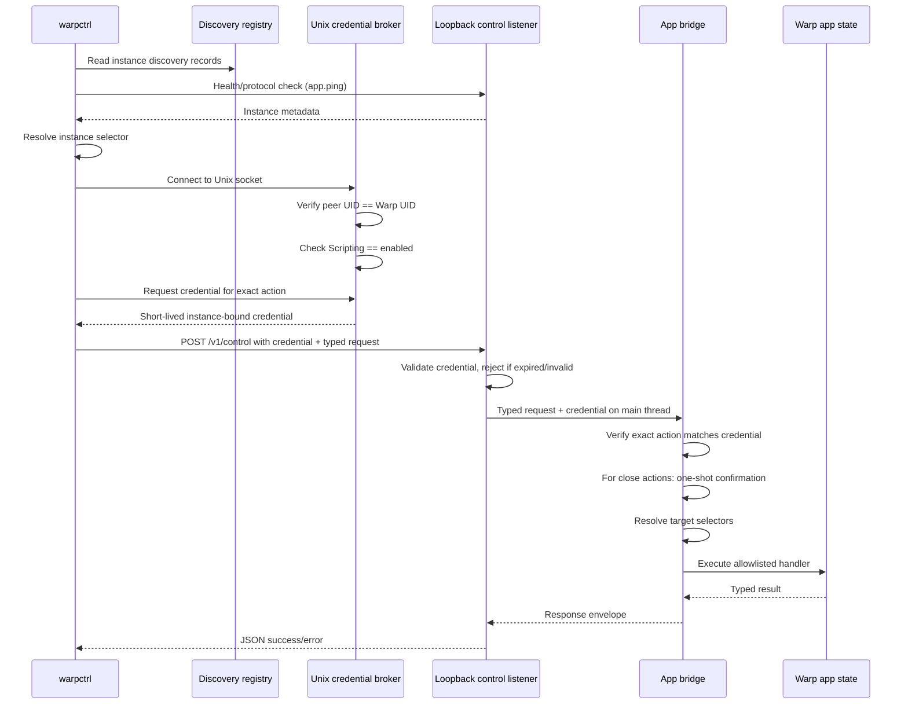

# Context
`PRODUCT.md` defines a local Warp control CLI (`warpctrl`) with an allowlisted catalog of exactly 75 actions, deterministic addressing across multiple running Warp app processes, and a simple enabled/disabled Scripting setting. `SECURITY.md` is the normative security architecture. If this technical plan and `SECURITY.md` disagree, update the plan before implementing.
The design is external-only: all callers are same-user processes. There is no inside-Warp/outside-Warp distinction, no verified-terminal invocation context, and no authenticated-user identity layer. Security relies on owner-only filesystem discovery, same-user Unix credential broker with kernel peer credentials, short-lived instance-bound exact-action credentials, loopback HTTP transport, and app-side enforcement.
## Existing building blocks
- `crates/http_server/src/lib.rs` runs a native-only loopback Axum server on fixed port `9277`.
- `app/src/lib.rs` registers that HTTP server and currently merges only installation-detection and profiling routers.
- `app/src/workspace/action.rs` defines tab creation and workspace actions.
- `app/src/pane_group/mod.rs` shows pane creation/splitting semantics.
- `app/src/settings/theme.rs` and `app/src/themes/theme_chooser.rs` define theme settings behavior.
- `crates/warp_cli/src/lib.rs` defines existing CLI/parser conventions and channel-specific command naming.
- `app/src/lib.rs` routes CLI invocations into CLI execution before GUI launch.
- `script/macos/bundle` and `script/linux/bundle` show wrapper-script packaging patterns.
## Proposed changes
### 0. Security architecture dependency
Before implementing any local-control listener, CLI command, credential path, or action handler, the implementation must be checked against `SECURITY.md`. Required security gates:
- Scripting has a single setting: disabled (default) or enabled.
- The authoritative value lives in protected local storage, not ordinary preferences.
- When disabled, no credentials are issued, no control requests are accepted, and discovery records contain no actionable endpoint.
- When enabled, same-user processes may request exact-action credentials from the broker.
- The broker authenticates the OS user through kernel peer credentials, not the calling application.
- Every credential grants one exact action, is bound to the issuing instance, and has a short expiry.
- The app bridge verifies the exact granted action before selector resolution or handler dispatch.
- The 3 close actions (`window.close`, `tab.close`, `pane.close`) require one-shot in-app confirmation.
- Input-staging commands never submit the buffer. There is no `input.run` action.
- `block.list` is absent from the 75-action catalog.
### 1. Protocol crate and stable envelope
Create a shared protocol crate used by both the app server and the `warpctrl` client. It defines:
- A request protocol version for defensive schema guarding.
- Discovery/health response types.
- The 75-action `ActionKind` enum with implementation status metadata.
- One-shot confirmation metadata for the 3 close actions.
- Selector types:
  - `InstanceSelector`: `Active`, `Id(InstanceId)`, `Pid(u32)`.
  - `WindowSelector`: `Active`, `Id(WindowId)`, `Index(u32)`, `Title(String)`.
  - `TabSelector`: `Active`, `Id(TabId)`, `Index(u32)`, `Title(String)`.
  - `PaneSelector`: `Active`, `Id(PaneId)`, `Index(u32)`.
  - `SessionSelector`: `Active`, `Id(SessionId)`, `Index(u32)`.
  - `BlockSelector`: `Id(BlockId)`.
  - `FileSelector`: `Path { path, line, column }`.
- Opaque protocol-facing ID newtypes for instance/window/tab/pane/session/block identifiers.
- Typed parameter payloads per action.
- Success/error envelopes with stable machine-readable error codes from `SECURITY.md`.
The protocol treats target IDs as opaque. Internal runtime IDs are implementation details.
Request shape for `tab.create`:
```json
{
  "protocol_version": 1,
  "request_id": "client-generated-id",
  "target": { "window": "active" },
  "action": { "kind": "tab.create", "params": {} }
}
```
Success response:
```json
{
  "protocol_version": 1,
  "request_id": "client-generated-id",
  "response": { "status": "ok", "data": {} }
}
```
Error response:
```json
{
  "protocol_version": 1,
  "request_id": "client-generated-id",
  "response": {
    "status": "error",
    "error": { "code": "missing_target", "message": "No active window is available", "details": null }
  }
}
```
Error codes include: `local_control_disabled`, `unauthorized_local_client`, `insufficient_permissions`, `confirmation_declined`, `ambiguous_instance`, `ambiguous_target`, `stale_target`, `missing_target`, `invalid_request`, `invalid_selector`, `invalid_params`, `unsupported_action`, `not_allowlisted`, `target_state_conflict`, `no_instance`.
### 2. Per-process discovery
Keep the existing fixed-port `9277` HTTP behavior intact. Add a separate local-control listener per process.
Design:
- Each Warp process creates a random opaque `instance_id` at startup.
- Each process binds a loopback control listener on an ephemeral port.
- Each process writes a discovery record into a secure per-user directory when Scripting is enabled.
- The record contains: `instance_id`, PID, channel/build metadata, control-listener endpoint, protocol version, start timestamp, and the filename of its instance-bound broker socket.
- The record does not contain bearer tokens, raw credentials, or control authority.
- The CLI loads records, rejects records whose endpoint is not exactly `127.0.0.1` or whose broker socket is not the expected filename, prunes stale records after health checks, and selects an instance using product selector rules.
- When Scripting is disabled, no discovery record is published.
Default discovery directory: `~/.warp/local-control/`. `$XDG_RUNTIME_DIR/warp/local-control` is preferred when available. On Unix, the directory is restricted to `0700` and records/sockets to `0600`.
### 3. Credential broker
The broker is a Unix-domain socket inside the owner-only discovery directory, one per instance. It is the protected path from discovery metadata to a short-lived exact-action credential.
Flow:
1. Client reads the discovery record to learn the broker socket filename.
2. Client connects to the socket.
3. Broker calls the platform peer-credential API and verifies the connecting process's UID equals Warp's effective UID. The broker authenticates the OS user, not the calling application.
4. Client sends a credential request naming one exact action.
5. Broker checks that Scripting is enabled and evaluates the requested action against the catalog.
6. Broker mints a short-lived credential in memory: instance-bound, one exact action, short expiry, unique credential ID.
7. Broker returns the credential to the client.
Properties:
- Credentials are never written to discovery records or disk.
- There is no stored bootstrap secret or reusable token.
- The broker evaluates current Scripting state at issuance time.
- Every credential is bound to exactly one action and one instance.
- Issued credentials exist only in the app's process-local credential map and the client's memory.
### 4. Transport: loopback HTTP
The control listener is an instance-local Axum server bound to `127.0.0.1` on an ephemeral port.
Before dispatch, the listener:
- Rejects requests carrying an `Origin` header.
- Requires the `Host` header to exactly match `127.0.0.1:<port>`.
- Requires a bearer credential present in the instance's process-local credential map.
- Rejects missing, malformed, expired, or wrong-instance credentials.
- Decodes the typed request only after transport authentication.
- Passes the request and credential to the app bridge for exact-action enforcement.
### 5. App-side request bridge
The HTTP handler runs on a Tokio runtime thread. It cannot directly access WarpUI state because all UI state is single-threaded on the main app event loop. The bridge transfers work to the main thread.
#### Thread model
- **Tokio thread (HTTP handler):** Owns the Axum router, validates transport credentials, deserializes the `RequestEnvelope`, hands the request to the bridge.
- **Main app thread:** Owns all WarpUI entities (`App`, `AppContext`, views, models). All UI state reads and mutations happen here.
- **Bridge:** Uses `ModelSpawner<LocalControlBridge>` to transfer a typed closure from the Tokio thread to the main thread, execute it with `&mut ModelContext`, and return the result.
#### Flow for `tab.create`
```
HTTP handler (Tokio thread)
  ├─ verify Scripting is enabled
  ├─ verify credential existence, expiry, instance binding
  ├─ deserialize RequestEnvelope
  ├─ call bridge_spawner.spawn(move |bridge, ctx| { ... }).await
  └─ serialize ResponseEnvelope as JSON

LocalControlBridge::handle_request (main thread)
  ├─ verify the credential grants the exact requested action
  ├─ for close actions: present one-shot confirmation, fail with confirmation_declined if declined
  ├─ match request.action.kind
  │   └─ ActionKind::TabCreate
  │       ├─ resolve window: active window, or sole window, or missing_target/ambiguous_target
  │       ├─ ctx.views_of_type::<Workspace>(window_id)
  │       └─ workspace.update(ctx, |workspace, ctx| {
  │             workspace.handle_action(&WorkspaceAction::AddTerminalTab { ... }, ctx)
  │           })
  └─ return ResponseEnvelope::ok(request_id, ...)
```
#### Adding new action handlers
1. Add an entry to the `ActionKind` catalog.
2. Add a match arm in `LocalControlBridge::handle_request`.
3. Verify the credential grants the exact action before selector resolution.
4. For close actions, enforce one-shot confirmation.
5. Resolve selectors and dispatch onto existing app types through `ctx`.
6. Return `ResponseEnvelope::ok(...)` or `ResponseEnvelope::error(...)`.
### 6. Target resolution
Implement target resolution as a reusable component.
Resolution order: instance → window → tab → pane → session.
Selector behavior:
- `active` resolves from current app focus state. For window-scoped mutations, a missing active window may fall back to the sole existing window.
- Explicit opaque IDs must resolve exactly or return `stale_target`.
- Index selectors resolve to a concrete opaque ID before execution.
- Title/name selectors are exact by default and return `ambiguous_target` on multiple matches.
- Session-scoped requests against non-terminal panes return `target_state_conflict`.
Target resolution happens after credential authentication and exact-action verification.
### 7. One-shot close confirmation
The 3 close actions (`window.close`, `tab.close`, `pane.close`) have a confirmation gate in the bridge:
1. After exact-action credential verification, the bridge checks if the action requires confirmation.
2. If so, the bridge presents a brief in-app confirmation dialog to the user.
3. The user must approve. If declined or ignored, the bridge returns `confirmation_declined`.
4. If approved, the bridge proceeds with target resolution and handler dispatch.
The confirmation is per-invocation. There is no "always allow" setting. All other 72 actions skip this step.
### 8. CLI parsing and output
The CLI uses the same libraries as the Oz CLI:
- **clap** (derive) for argument parsing and subcommand trees.
- **serde** / **serde_json** for JSON serialization.
- **clap_complete** for shell completion generation.
- `OutputFormat` enum (`Pretty`, `Json`, `Text`) shared from `warp_cli`.
New subcommand types live in `warp_cli::local_control` and follow existing `#[derive(Parser)]` patterns.
### 9. CLI packaging
The shipped product is a bundled `warpctrl` wrapper script that calls the channel-specific Warp binary with a hidden `--warpctrl` flag:
- **macOS:** `Resources/bin/warpctrl` wrapper in the app bundle, same pattern as the Oz wrapper.
- **Linux:** Small `warpctrl` wrapper or symlink in the app package.
- **Windows:** Fails closed until authenticated broker transport is implemented.
Startup: `app/src/lib.rs` recognizes `--warpctrl` before app launch and routes into `warp_cli::local_control`. The control-mode path initializes only command parsing, discovery, credential material, HTTP transport, and output formatting. It does not initialize GUI state, rendering, or terminal session models.
### 10. Feature flag
Gate behind `FeatureFlag::WarpControlCli` with Cargo feature `warp_control_cli`.
When disabled:
- No Scripting settings page.
- No `LocalControlBridge`, `LocalControlServer`, discovery records, broker sockets, or `/v1/control` endpoints.
- The `warpctrl` wrapper returns a structured `no_instance` or feature-disabled error.
When enabled:
- Settings > Scripting page is rendered.
- All local-control infrastructure starts when Scripting is enabled by the user.
### 11. First slice: discovery + `tab.create`
The first implementation slice proves the end-to-end architecture:
- Shared protocol types and error envelopes.
- `FeatureFlag::WarpControlCli` and Cargo feature.
- Settings > Scripting page with enabled/disabled toggle.
- Protected local-only mode storage (defaults disabled).
- Discovery registry and CLI instance selection.
- `warpctrl` wrapper entrypoint with `--warpctrl` control-mode dispatch.
- Per-process credential broker (Unix socket, peer credential check).
- Loopback control listener.
- App-side request bridge with `ModelSpawner`.
- Exact-action credential issuance and enforcement.
- `app.ping`, `app.version`, `instance.list`, and `tab.create`.
- Structured success/error output in pretty and JSON formats.
### 12. Follow-up slices
After the first slice validates the architecture, add remaining catalog actions in family groups:
- Window/tab mutations (including close with one-shot confirmation).
- Pane mutations (including close with one-shot confirmation).
- Session/input actions (staging only, never submitting).
- Block reads (inspect and output; block.list absent).
- Appearance/theme actions.
- Settings reads and writes.
- Surface toggles.
- File open intent.
Each addition extends the `ActionKind` catalog, adds a handler, adds validation/tests, and adds CLI surface.
## End-to-end flow

## Testing
- **Catalog invariant:** Every `ActionKind` with `Implemented` status has a parseable `warpctrl` CLI route, generated help/completion coverage, and an app-side bridge handler.
- **Scripting gate:** Disabled state rejects all credential requests and control requests. Enabled state allows them. Toggling invalidates outstanding credentials.
- **Credential model:** Raw credentials never appear in discovery records. Credentials are instance-bound, action-bound, and short-lived. A credential for one action fails with `insufficient_permissions` for any other action.
- **One-shot confirmation:** Close actions fail with `confirmation_declined` when declined. Non-close actions skip confirmation.
- **Selector resolution:** Tests for active, explicit ID, index, stale target, ambiguous target, missing target, and target-state-conflict cases.
- **Input staging:** Input commands stage text only. No `input.run` exists. Tests prove no buffer submission occurs.
- **block.list absent:** The catalog does not contain `block.list`. Requesting it returns `not_allowlisted`.
- **Unsupported platforms:** Windows fails closed with no fallback.
- **Action count:** Tests verify the catalog contains exactly 75 actions, 72 default-authorized, 3 requiring confirmation.
## Risks and mitigations
- **Same-user residual risk:** The broker authenticates the OS user, not the calling application. Any process running as the same user can request credentials. Mitigated by: protected enablement, short expiry, exact-action grants, app-side revalidation, one-shot confirmation for destructive actions.
- **Browser-to-localhost:** Mitigated by: no permissive CORS, Origin header rejection, Host header validation, credential requirement.
- **Fixed-port contention:** Mitigated by: leaving `9277` undisturbed, using per-process ephemeral ports for control.
- **Input execution risk:** Mitigated by: no `input.run` in the catalog, input commands stage text only, tests prove no submission.
- **Heavyweight CLI startup:** Mitigated by: `--warpctrl` routes before GUI launch, control-mode path initializes only what's needed.
